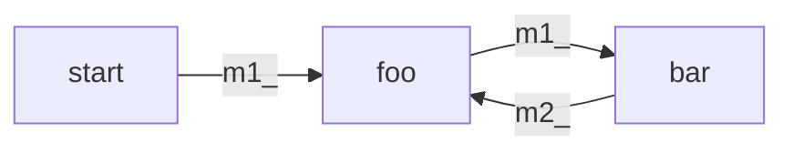
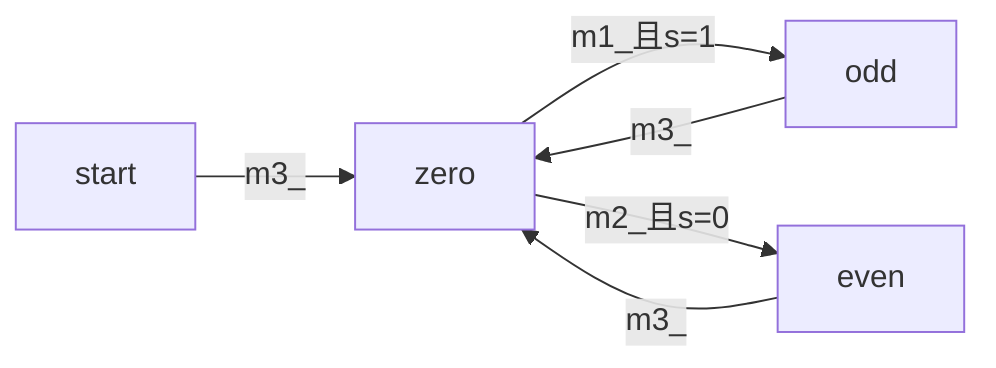
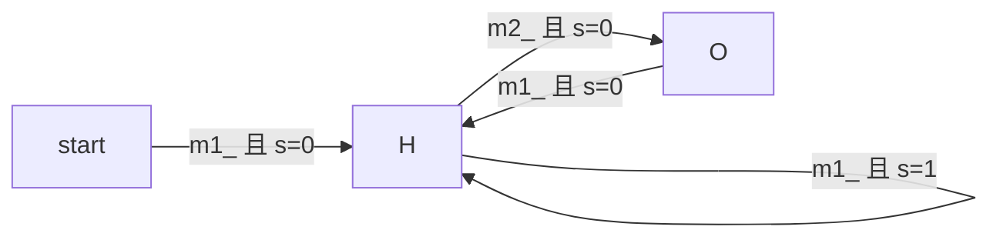

### 1114. Print in Order

方法一：通过状态变量来控制函数的执行顺序。

```c
#include <unistd.h>

class Foo {
public:
    Foo() {    
    }

    void first(function<void()> printFirst) {
        // printFirst() outputs "first". Do not change or remove this line.
        printFirst();
        status = 1;
    }

    void second(function<void()> printSecond) {
        // printSecond() outputs "second". Do not change or remove this line.
        while(status != 1) usleep(1);
        printSecond();
        status = 2;
    }

    void third(function<void()> printThird) {
        // printThird() outputs "third". Do not change or remove this line.
        while(status != 2) usleep(1);
        printThird();
    }

private:
    int status = 0;
};

```


方法二：通过互斥锁控制函数执行顺序

```c
class Foo {
public:
    Foo() {
        m2_.lock();
        m3_.lock();
    }

    void first(function<void()> printFirst) {
        // printFirst() outputs "first". Do not change or remove this line.
        printFirst();
        m2_.unlock();
    }

    void second(function<void()> printSecond) {
        // printSecond() outputs "second". Do not change or remove this line.
        m2_.lock();
        printSecond();
        m3_.unlock();
    }

    void third(function<void()> printThird) {
        // printThird() outputs "third". Do not change or remove this line.
        m3_.lock();
        printThird();
    }

private:
    mutex m2_, m3_;
};
```


### 1115. Print FooBar Alternately




```c
class FooBar {
private:
    mutex m1_, m2_;
    int n;

public:
    FooBar(int n) {
        this->n = n;

        m1_.lock();
    }

    void foo(function<void()> printFoo) {
        
        for (int i = 0; i < n; i++) {
            m2_.lock();
                
        		printFoo();
            
            m1_.unlock();
        }
    }

    void bar(function<void()> printBar) {
        
        for (int i = 0; i < n; i++) {
            m1_.lock();
            
        		printBar();
            
            m2_.unlock();
        }
    }
};
```


### 1116. Print Zero Even Odd



```c
class ZeroEvenOdd {
private:
    int n;
    int status_;
    mutex m1_, m2_, m3_, m4_;

public:
    ZeroEvenOdd(int n) {
        this->n = n;
        status_ = 1;
        
        m1_.lock();
        m2_.lock();
    }

    // printNumber(x) outputs "x", where x is an integer.
    void zero(function<void(int)> printNumber) {
        for(int i = 1; i <= n; ++i){
            
            m3_.lock();
            
            printNumber(0);
            cout<<0;
            
            if(status_ == 0)
                m2_.unlock();
            else
                m1_.unlock();
        }
    }

    void odd(function<void(int)> printNumber) {

        for(int i = 1; i <= n; i+=2){
            m1_.lock();
            printNumber(i);
            cout<<i;
            status_ = 0;
            m3_.unlock();
        }
    }
    
    void even(function<void(int)> printNumber) {
        for(int i = 2; i <= n; i+=2){
            m2_.lock();
            printNumber(i);
            cout<<i;
            status_ = 1;
            m3_.unlock();
        }
    }
};
```


### 1117. Building H2O



```c
class H2O {
public:
    H2O() {
        m2_.lock();
        status_ = 0;
    }

    void hydrogen(function<void()> releaseHydrogen) {
        

        m1_.lock();
        releaseHydrogen();
        cout<<"H";
        
        if(status_ == 0){
            status_ = 1;
            m1_.unlock();
        }

        else if(status_ == 1) {
            status_ = 0;
            m2_.unlock();
        }
    }

    void oxygen(function<void()> releaseOxygen) {
        
        m2_.lock();
        releaseOxygen();
        cout<<"O";
        m1_.unlock();
    }
    
private:
    mutex m1_, m2_;
    int status_;
};
```

