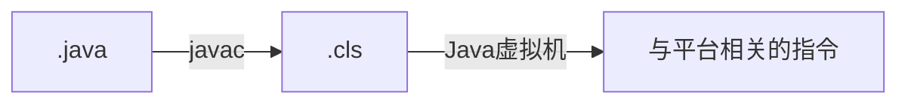
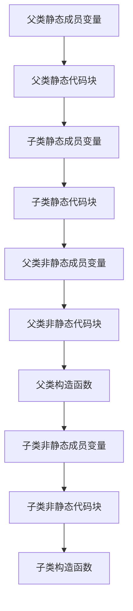

#### 什么是Java虚拟机？为什么Java被称作是“平台无关的编程语言“？

Java虚拟机是一个可以执行Java字节码的虚拟机进程。



Java编译器将.java文件编译成.class文件，再由Java虚拟机解释（此处存争议，后面解释）生成与平台相关的指令。与Java语言直接相关的是javac，且对于不同平台，javac生成的字节码完全相同，所以我们说Java是与平台无关的编程语言。


问题已经回答完了，下面思考另外两个问题。


“Java虚拟机解释生成与平台相关的指令”的叙述准确吗？答案是不准确。javac编译Java源文件是确定无疑的，但是不同Java虚拟机的实现采用的方式不同，很可能同时含有编译和解释技术，如Oracle的HotSpot VM采用jit compile(just in time compilation)技术，将运行频率很高的字节码直接编译为机器指令执行以提高性能。


Java为什么是编译型语言，而不是教科书上说的半编译半解释？首先我们可以确认Java虚拟机是与平台相关的，因为针对不同的平台，Java虚拟机产生的指令不尽相同。那么如果我们说Java是与平台无关的编程语言（注意这里仅从语言的角度考虑），说明Java虚拟机作为解释和运行环境不包括在Java语言中的，有人可能觉得这是理所当然，但是我们必须明确这一点。重新叙述下得出的结论：Java虚拟机不是Java语言的一部分，而javac直接编译Java语言，与java语言直接相关，进而得出Java是编译型语言。编译是将相对高级的语言转换成相对低级的语言，.java文件到.class文件的转换符合这样的特征。如果我们说Java是半编译半解释，且与平台无关，但是以“解释”为主的Java虚拟机与平台相关，相互矛盾。


最终结论：虽然上面已经尽力解释了，但是还是有点绕，所以越来越不推荐使用编译型或者解释型描述编程语言。而是用诸如强类型的、弱类型的，静态的、动态的，GC-based的、手工管理内存的概念描述。


> [Java 是编译型语言还是解释型语言？@温悦 @不朵不藏](https://www.zhihu.com/question/19608553)


#### 被protected修饰的类成员在什么时候可以被访问？


非内部类访问权限修饰符仅有public和包访问权限两种；类成员访问权限有private、包访问权限、protected和public四种。


用包访问权限修饰的非内部类，仅对包内可见，通过查阅上图前三行即一目了然。

用public修饰的非内部类，记作A，A有protected修饰的成员clone()，B继承A，但与A不同包，在B中访问A的成员clone()较为复杂，看下面的代码：

```java
package p2;
class A {
    protected Object clone() throws CloneNotSupportedException{
       return super.clone();
    }
}

package p22;
public class B extends A {
    public static void main(String args[]) {
       A a = new A();
       a.clone();  // Compile Error      	----（1）

       B b = new B();
       b.clone();  // Complie OK       	  	----（2）
    }
}
```

这个代码很好解释了上图标有星号的地方。若子类与基类不在同一包中，那么在子类中，子类实例可以访问其从基类继承而来的protected方法，对应（2）处访问无误，而不能访问基类实例的protected方法，所以（1）处编译错误。


> [Java 访问权限控制：你真的了解 protected 关键字吗？](https://blog.csdn.net/justloveyou_/article/details/61672133)


#### 重载与重写区别？

重载和重写有个记忆口诀，如下：

**重写：一大两小两同**

- 一大：子类的方法访问权限控制符只能相同或变大；
- 两小：抛出异常和返回值类型只能变小， 能够转型成父类对象。子类的返回值类型、
    抛出异常类型必须与父类的返回值类型、抛出异常类型存在继承关系。非强制性异常类型RuntimeException不在上面的异常类型范围内；
- 两同：方法名和参数必须完全相同。


**重载：一同一不同**

- 方法名字必须相同；
- 参数列表必须不同，参数个数或者参数类型顺序至少一个不同。

注意：方法可以在子类中被重载。访问权限、返回值类型、异常类型没有要求。


#### 进程和线程的区别？

基本单位：进程是资源分配的基本单位，线程是CPU调度的基本单位。

内存共享：进程间相互独立，互不影响，更健壮，线程间共享进程的内存；

通信方式：进程间通过IPC（InterProcess Communication），不同线程直接读取进程数据段来进行通信并使用PV操作保证数据的一致性；

切换效率：进程切换耗费资源大，效率低，线程切换更高效。


形象理解：[进程与线程的一个简单解释](http://www.ruanyifeng.com/blog/2013/04/processes_and_threads.html)


#### 创建线程有哪几种不同的方式？什么是线程安全？

1. 继承Thread类
2. 实现Runable接口
3. 通过Callable和FutureTask创建**有返回值**的线程
4. 通过线程池创建线程


第一种：

```java
public class ThreadTest extends Thread {
    private int i = 0;

    //重写run方法，run方法的方法体就是现场执行体
    public void run() {
        for (; i < 100; i++) {
            System.out.println(getName() + "  " + i);

        }
    }

    public static void main(String[] args) {
        for (int i = 0; i < 100; i++) {
            System.out.println(Thread.currentThread().getName() + "  : " + i);
            if (i == 20) {
                new FirstThreadTest().start();
                new FirstThreadTest().start();
            }
        }
    }

}
```


第二种：
```java
public class RunnableTest implements Runnable {

    private int i;

    public void run() {
        for (i = 0; i < 100; i++) {
            System.out.println(Thread.currentThread().getName() + " " + i);
        }
    }

    public static void main(String[] args) {
        for (int i = 0; i < 100; i++) {
            System.out.println(Thread.currentThread().getName() + " " + i);
            if (i == 20) {
                RunnableTest rtt = new RunnableTest();
                new Thread(rtt, "新线程1").start();
                new Thread(rtt, "新线程2").start();
            }
        }
    }
    
}
```


包含第三种与第四种：
```java
import java.util.concurrent.*;

public class FutureTaskTest {

    public static void main(String[] args) {
        Task task = new Task();// 新建异步任务
        FutureTask<Integer> future = new FutureTask<Integer>(task) {
            // 异步任务执行完成，回调
            @Override
            protected void done() {
                try {
                    System.out.println("future.done():" + get());
                } catch (InterruptedException | ExecutionException e) {
                    e.printStackTrace();
                }
            }
        };

        // 创建线程池（使用了预定义的配置）
        ExecutorService executor = Executors.newCachedThreadPool();
        executor.execute(future);
        
        // new Thread(future, "有返回值的线程").start();

        try {
            Thread.sleep(1000);
        } catch (InterruptedException e) {
            e.printStackTrace();
        }

        // 可以取消异步任务
        // future.cancel(true);

        try {
            // 阻塞，等待异步任务执行完毕-获取异步任务的返回值
            System.out.println("future.get():" + future.get());
        } catch (InterruptedException e) {
            e.printStackTrace();
        } catch (ExecutionException e) {
            e.printStackTrace();
        }
    }

    // 异步任务
    static class Task implements Callable<Integer> {
        // 返回异步任务的执行结果
        @Override
        public Integer call() throws Exception {
            int i = 0;
            for (; i < 10; i++) {
                try {
                    System.out.println(Thread.currentThread().getName() + "_" + i);
                    Thread.sleep(500);
                } catch (InterruptedException e) {
                    e.printStackTrace();
                }
            }
            return i;
        }
    }

}

```


一个不论运行时如何调度线程都不需要提供额外的同步和协调机制还能正确地运行的类是线程安全的。

https://blog.csdn.net/u012973218/article/details/51280044


#### yield、sleep、join、wait的区别


> https://www.cnblogs.com/aspirant/p/8876670.html


#### volatile原理与作用，是否能替代锁？


#### 类实例化过程中，成员变量、代码块以及构造函数的执行顺序？



>  https://www.nowcoder.com/test/question/done?tid=26611088&qid=166825#summary


#### 反射中，Class.forName和ClassLoader.loadCalss方法的区别?


- 装载：通过累的全限定名获取二进制字节流，将二进制字节流转换成方法区中的运行时数据结构，在内存中生成Java.lang.class对象； 

- 链接：执行下面的校验、准备和解析步骤，其中解析步骤是可以选择的； 
    - 校验：检查导入类或接口的二进制数据的正确性（文件格式验证，元数据验证，字节码验证，符号引用验证） ；
    - 准备：给类的静态变量分配并初始化存储空间； 　　
    - 解析：将常量池中的符号引用转成直接引用； 

- 初始化：激活类的静态变量的初始化Java代码和静态Java代码块，并初始化程序员设置的变量值。

    
```java
public static Class<?> forName(String className) throws ClassNotFoundException {
	Class<?> caller = Reflection.getCallerClass();
	return forName0(className, true, ClassLoader.getClassLoader(caller), caller);
}
```

return中forName0方法的第二个参数表示默认进行类初始化。


```java
public Class<?> loadClass(String name) throws ClassNotFoundException {
	return loadClass(name, false);
}
```

return中loadClass方法的第二个参数表示默认不进行类链接。


> https://blog.csdn.net/xie_xiansheng/article/details/52958012


#### 序列化有什么用？为什么序列化接口无成员？serialVersionUID有什么含义？

序列化：    把对象转换成**字节序列**的过程。

反序列化：把**字节序列**恢复成对象的过程。


实现Serializable 接口的时候，一定要给 serialVersionUID 赋值。否则在类代码变更后，将无法反序列化代码变更前序列化的对象的字节序列。


为什么序列化接口无成员还无解。


#### hashCode如何生成？在基于散列的集合中有什么作用？

String类中hashCode如下：

```java
public int hashCode() {
    int h = hash;
    if (h == 0 && value.length > 0) {
        char val[] = value;

        for (int i = 0; i < value.length; i++) {
            h = 31 * h + val[i];
        }
        
        hash = h;
    }
    return h;
}
```

为什么选不大不小的质数31参考 https://segmentfault.com/a/1190000010799123。


#### JVM的内存结构，Eden和Survivor比例是多少？

栈，包括java方法栈与本地方法栈

堆

方法区（非堆、静态区）

程序计数器


堆被进一步划分：


默认 Yong : Old=1 : 2，Eden : from : to = 8 : 1 : 1。

JVM每次只使用Eden和一块Survivor（from或to）区域为对象服务。故总有一块Survivor区域是空闲的。


Yong是GC频繁的区域。


VM选项有三种：

- \- : 标准VM选项，VM规范的选项
- -X: 非标准VM选项，不保证所有VM支持
- -XX: 高级选项，高级特性，但属于不稳定的选项

参见 [Java HotSpot VM Options](https://link.zhihu.com/?target=http%3A//www.oracle.com/technetwork/java/javase/tech/vmoptions-jsp-140102.html%23Options)


再说这几个参数，其语义分别是：

- -Xmx: 堆的最大内存数，等同于-XX:MaxHeapSize
- -Xms: 堆的初始化初始化大小
- -Xmn: 堆中新生代初始及最大大小，如果需要进一步细化，初始化大小用-XX:NewSize，最大大小用-XX:MaxNewSize 
- -Xss: 线程栈大小，等同于-XX:ThreadStackSize

- -XXSurvivorRatio：年轻代中2个Survivor与eden的比，3表示Survivor：eden=2:3，故Survivor区总大小=**5120****/5\*2=2048**

- -XXNewRatio：老年代（不含永久代）与年轻代（eden+2*survivor）的比值


命名应该非简称，助记的话： memory maximum, memory startup, memory nursery/new, stack size. 

> https://www.zhihu.com/question/59957834@Home3k


#### 类加载器种类，可以打破双亲委派模型吗，怎么打破？


**类加载器与双亲委派模型**

- **启动**类加载器
- 标准扩展类加载器
- 应用程序类加载器

除此之外还有自定义类加载器，他们之间的层次关系被称为类加载器的双亲委派模型。

该模型要求除了顶层的启动类加载器外，其余的类加载器都应该有自己的父类加载器，而这种父子关系一般通过**组合**（Composition）关系来实现，而不是通过继承（Inheritance）。


某个特定的类加载器在接到加载类的请求时，首先将加载任务委托给父类加载器，依次递归，如果父类加载器可以完成类加载任务，就成功返回；只有父类加载器无法完成此加载任务时，才自己去加载。


**双亲委派模型的系统实现**

在java.lang.ClassLoader的loadClass()方法中，先检查是否已经被加载过，若没有加载则调用父类加载器的loadClass()方法，若父加载器为空则默认使用启动类加载器作为父加载器。如果父加载器加载失败，则抛出ClassNotFoundException异常后，再调用自己的findClass()方法进行加载。

```java
protected synchronized Class<?> loadClass(String name,boolean resolve)throws ClassNotFoundException{
    //check the class has been loaded or not
    Class c = findLoadedClass(name);
    if(c == null){
        try{
            if(parent != null){
                c = parent.loadClass(name,false);
            }else{
                c = findBootstrapClassOrNull(name);
            }
        }catch(ClassNotFoundException e){
            //if throws the exception ,the father can not complete the load
        }
        if(c == null){
            c = findClass(name);
        }
    }
    if(resolve){
        resolveClass(c);
    }
    return c;
}
```


**打破双亲委派模型**

打破双亲委派机制则要继承ClassLoader类，不仅要重写loadClass，还要重写findClass方法。


#### select、epoll和poll的区别

select、poll和poll都是IO多路复用机制。


**select缺点：**

1. 每次调用select，都需要把fd集合从用户态拷贝到内核态，这个开销在fd很多时会很大；

2. 同时每次调用select都需要在内核遍历传递进来的所有fd，这个开销在fd很多时也很大；

3. select支持的文件描述符数量太小，默认是1024。


poll的实现和select非常相似，只是描述fd集合的方式不同，poll使用pollfd结构而不是select的fd_set结构。


**epoll**

共享内存

事件通知


#### 正则匹配 http://www.bilibili.com/video/av21061574


`.` ：匹配除"\r\n"之外的任何单个字符，与`[^\r\n]`等效；

`\w`：与`[A-Za-z0-9_]`等效；

`\W`：与`[^A-Za-z0-9_]`等效；

`\s`：匹配任何空白字符，与` [\f\n\r\t\v]` 等效；

`\S`：与` [^\f\n\r\t\v]` 等效；

`\d`：与`[0-9]`等效；

`\D`：与`[^0-9]`等效。


#### ThreadLocal

每个Thread对象内部都维护了一个ThreadLocalMap，ThreadLocal定义的对象会被复制到每一个线程的ThreadLocalMap中。


#### 集合类


https://blog.csdn.net/hagle_wang/article/details/78501933


#### 生产者与消费者

```java
package io.github.earthstrider.test;

import java.util.PriorityQueue;

public class ProducerAndConsumer {
    private int capacity = 3;
    private PriorityQueue<Integer> queue = new PriorityQueue(capacity);

    public static void main(String[] args) {
        ProducerAndConsumer pc = new ProducerAndConsumer();
        Producer produce = pc.new Producer();
        Consumer consumer = pc.new Consumer();

        produce.start();
        consumer.start();
    }

    class Producer extends Thread {
        private int value=1;
        @Override
        public void run() {
            produce();
        }

        public void produce() {
            while(true){
                synchronized (queue) {
                    while (queue.size() >= capacity) {
                        try {
                            System.out.println("队列空，等待数据");
                            queue.wait();
                        } catch (InterruptedException e) {
                            e.printStackTrace();
                            queue.notify();
                        }
                    }
                    queue.offer(value);

                    System.out.println("向队列取中插入一个元素" + value + "，队列剩余空间：" + (capacity - queue.size()));
                    value++;
                    queue.notify();
                }
            }
        }
    }

    class Consumer extends Thread {
        @Override
        public void run() {
            consume();
        }

        public void consume() {
            while(true){
                synchronized (queue) {
                    while (queue.size() <= 0) {
                        try {
                            System.out.println("队列满，等待有空余空间");
                            queue.wait();

                        } catch (InterruptedException e) {
                            e.printStackTrace();
                            queue.notify();
                        }
                    }
                    int value = queue.poll();
                    System.out.println("从队列取走一个元素" + value + "，队列剩余" + queue.size() + "个元素");

                    queue.notify();
                }
            }
        }
    }

}
```


#### 死锁

死锁是指两个或两个以上的进程在执行过程中，因争夺资源而造成的一种互相等待的现象，若无外力作用，它们将无法推进下去。


产生死锁的**四个必要条件**：

（1） 互斥条件：一个资源每次只能被一个进程使用。

（2） 占有且等待：一个进程因请求资源而阻塞时，对已获得的资源保持不放。

（3）不可强行占有:进程已获得的资源，在末使用完之前，不能强行剥夺。

（4） 循环等待条件:若干进程之间形成一种头尾相接的循环等待资源关系。

这四个条件是死锁的必要条件，只要系统发生死锁，这些条件必然成立，而只要上述条件之一不满足，就不会发生死锁。


处理死锁方法

鸵鸟策略（视而不见）

死锁预防（死锁发生之前）

死锁避免（死锁发生之前）

死锁检测与死锁解除（死锁发生之后）


死锁避免方法：银行家算法

当一个进程申请使用资源的时候，银行家算法通过先**试探**分配给该进程资源，然后通过安全性算法判断分配后的系统是否处于安全状态，若不安全则试探分配作废，让该进程继续等待。

Allocation：已分配的资源数

Need：还需要的资源数

Available：可分配的资源数


该状态是否安全？

安全，安全序列如下：


```java
import java.util.Scanner;

public class BankerTest {

    int[] Available = {10, 8, 7};
    int[][] Max = new int[3][3];
    int[][] Alloction = new int[3][3];
    int[][] Need = new int[3][3];
    int[][] Request = new int[3][3];
    int[] Work = new int[3];

    int num = 0;//进程编号
    Scanner in = new Scanner(System.in);

    public static void main(String[] args) {
        // TODO code application logic here
        boolean Choose = true;
        String C;
        Scanner in = new Scanner(System.in);
        BankerTest T = new BankerTest();
        System.out.println("这是一个三个进程，初始系统可用三类资源为{10,8,7}的银行家算法：");

        T.setSystemVariable();
        while (Choose == true) {
            T.setRequest();
            System.out.println("您是否还要进行请求：y/n?");
            C = in.nextLine();
            if (C.endsWith("n")) {
                Choose = false;
            }
        }
    }

                           //10, 8, 7
    public BankerTest() {
        Max = new int[][]{{11,1,1},{5,1,8},{2,8,2}};

        Need = Max;

        Alloction = new int[][]{{0,0,0},{0,0,0},{1,0,1}};

    }

    public void setSystemVariable() {//设置各初始系统变量，并判断是否处于安全状态。
        setMax();
        setAlloction();
        printSystemVariable();
        SecurityAlgorithm();
    }

    public void setMax() {//设置Max矩阵
//        System.out.println("请设置各进程的最大需求矩阵Max：   y/n");
//        String  C = new Scanner(System.in).nextLine();
//        if(C.equals("n")){
//            return;
//        }
//        for (int i = 0; i < 3; i++) {
//            System.out.println("请输入进程P" + i + "的最大资源需求量：");
//            for (int j = 0; j < 3; j++) {
//                Max[i][j] = in.nextInt();
//            }
//        }
    }

    public void setAlloction() {//设置已分配矩阵Alloction
//        System.out.println("请设置请各进程分配矩阵Alloction：");
//        for (int i = 0; i < 3; i++) {
//            System.out.println("晴输入进程P" + i + "的分配资源量：");
//            for (int j = 0; j < 3; j++) {
//                Alloction[i][j] = in.nextInt();
//            }
//        }
//        System.out.println("Available=Available-Alloction.");
//        System.out.println("Need=Max-Alloction.");
//        for (int i = 0; i < 3; i++) {//设置Alloction矩阵
//            for (int j = 0; j < 3; j++) {
//                Available[i] = Available[i] - Alloction[j][i];
//            }
//        }
//        for (int i = 0; i < 3; i++) {//设置Need矩阵
//            for (int j = 0; j < 3; j++) {
//                Need[i][j] = Max[i][j] - Alloction[i][j];
//            }
//        }
    }

    public void printSystemVariable() {
        System.out.println("此时资源分配量如下：");
        System.out.println("进程  " + "   Max   " + "   Alloction " + "    Need  " + "     Available ");
        for (int i = 0; i < 3; i++) {
            System.out.print("P" + i + "  ");
            for (int j = 0; j < 3; j++) {
                System.out.print(Max[i][j] + "  ");
            }
            System.out.print("|  ");
            for (int j = 0; j < 3; j++) {
                System.out.print(Alloction[i][j] + "  ");
            }
            System.out.print("|  ");
            for (int j = 0; j < 3; j++) {
                System.out.print(Need[i][j] + "  ");
            }
            System.out.print("|  ");
            if (i == 0) {
                for (int j = 0; j < 3; j++) {
                    System.out.print(Available[j] + "  ");
                }
            }
            System.out.println();
        }
    }

    public void setRequest() {//设置请求资源量Request


        System.out.println("请输入请求资源的进程编号：");
        num = in.nextInt();//设置全局变量进程编号num
        System.out.println("请输入请求各资源的数量：");
        for (int j = 0; j < 3; j++) {
            Request[num][j] = in.nextInt();
        }
        System.out.println("即进程P" + num + "对各资源请求Request：(" + Request[num][0] + "," + Request[num][1] + "," + Request[num][2] + ").");

        BankerAlgorithm();
    }

    public void BankerAlgorithm() {//银行家算法
        boolean T = true;

        if (Request[num][0] <= Need[num][0] && Request[num][1] <= Need[num][1] && Request[num][2] <= Need[num][2]) {//判断Request是否小于Need
            if (Request[num][0] <= Available[0] && Request[num][1] <= Available[1] && Request[num][2] <= Available[2]) {//判断Request是否小于Alloction
                for (int i = 0; i < 3; i++) {
                    Available[i] -= Request[num][i];
                    Alloction[num][i] += Request[num][i];
                    Need[num][i] -= Request[num][i];
                }

            } else {
                System.out.println("当前没有足够的资源可分配，进程P" + num + "需等待。");
                T = false;
            }
        } else {
            System.out.println("进程P" + num + "请求已经超出最大需求量Need.");
            T = false;
        }

        if (T == true) {
            printSystemVariable();
            System.out.println("现在进入安全算法：");
            SecurityAlgorithm();
        }
    }


    public void SecurityAlgorithm() {//安全算法
        boolean[] Finish = {false, false, false};//初始化Finish
        int count = 0;//完成进程数
        int circle = 0;//循环圈数
        int[] S = new int[3];//安全序列
        for (int i = 0; i < 3; i++) {  //设置工作向量
            Work[i] = Available[i];
        }
        boolean flag = true;
        while (count < 3) {
            if (flag) {
                System.out.println("进程  " + "   Work  " + "   Alloction " + "    Need  " + "     Work+Alloction ");
                flag = false;
            }
            for (int i = 0; i < 3; i++) {

                if (Finish[i] == false && Need[i][0] <= Work[0] && Need[i][1] <= Work[1] && Need[i][2] <= Work[2]) {//判断条件
                    System.out.print("P" + i + "  ");
                    for (int k = 0; k < 3; k++) {
                        System.out.print(Work[k] + "  ");
                    }
                    System.out.print("|  ");
                    for (int j = 0; j < 3; j++) {
                        Work[j] += Alloction[i][j];
                    }
                    Finish[i] = true;//当当前进程能满足时
                    S[count] = i;//设置当前序列排号

                    count++;//满足进程数加1
                    for (int j = 0; j < 3; j++) {
                        System.out.print(Alloction[i][j] + "  ");
                    }
                    System.out.print("|  ");
                    for (int j = 0; j < 3; j++) {
                        System.out.print(Need[i][j] + "  ");
                    }
                    System.out.print("|  ");
                    for (int j = 0; j < 3; j++) {
                        System.out.print(Work[j] + "  ");
                    }
                    System.out.println();
                }

            }
            circle++;//循环圈数加1

            if (count == 3) {//判断是否满足所有进程需要
                System.out.print("此时存在一个安全序列：");
                for (int i = 0; i < 3; i++) {//输出安全序列
                    System.out.print("P" + S[i] + " ");
                }
                System.out.println("故当前可分配！");
                break;//跳出循环
            }
            if (count < circle) {//判断完成进程数是否小于循环圈数
                count = 5;
                System.out.println("当前系统处于不安全状态，故不存在安全序列。");
                break;//跳出循环
            }
        }
    }

}
```


### TCP/IP协议族


路由器只有IP层及以下协议，其位于网络核心中，不需要为进程或者应用程序提供服务，因此也就不需要传输层和应用层。


#### ConcurrentHashMap的实现原理


####  Java中的四种引用及其应用场景


#### InterruptedException 与 ExecutionException


#### 编译工具