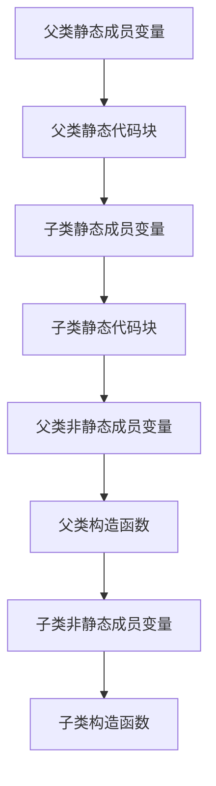

#### 什么是Java虚拟机？为什么Java被称作是“平台无关的编程语言“？

Java虚拟机是一个可以执行Java字节码的虚拟机进程。


Java编译器将.java文件编译成.class文件，再由Java虚拟机解释（此处存争议，后面解释）生成与平台相关的指令。与Java语言直接相关的是javac，且对于不同平台，javac生成的字节码完全相同，所以我们说Java是与平台无关的编程语言。


问题已经回答完了，下面思考另外两个问题。


“Java虚拟机解释生成与平台相关的指令”的叙述准确吗？答案是不准确。javac编译Java源文件是确定无疑的，但是不同Java虚拟机的实现采用的方式不同，很可能同时含有编译和解释技术，如Oracle的HotSpot VM采用jit compile(just in time compilation)技术，将运行频率很高的字节码直接编译为机器指令执行以提高性能。


Java为什么是编译型语言，而不是教科书上说的半编译半解释？首先我们可以确认Java虚拟机是与平台相关的，因为针对不同的平台，Java虚拟机产生的指令不尽相同。那么如果我们说Java是与平台无关的编程语言（注意这里仅从语言的角度考虑），说明Java虚拟机作为解释和运行环境不包括在Java语言中的，有人可能觉得这是理所当然，但是我们必须明确这一点。重新叙述下得出的结论：Java虚拟机不是Java语言的一部分，而javac直接编译Java语言，与java语言直接相关，进而得出Java是编译型语言。编译是将相对高级的语言转换成相对低级的语言，.java文件到.class文件的转换符合这样的特征。如果我们说Java是半编译半解释，且与平台无关，但是以“解释”为主的Java虚拟机与平台相关，相互冲突。


最终结论：虽然上面已经尽力解释了，但是还是有点绕，所以越来越不推荐使用编译型或者解释型描述编程语言。而是用诸如强类型的、弱类型的，静态的、动态的，GC-based的、手工管理内存的概念描述。


> [Java 是编译型语言还是解释型语言？@温悦 @不朵不藏](https://www.zhihu.com/question/19608553)


#### 被protected修饰的类成员在什么时候可以被访问？


非内部类访问权限修饰符仅有public和包访问权限两种；类成员访问权限有private、包访问权限、protected和public四种。


用包访问权限修饰的非内部类，仅对包内可见，通过查阅上图前三行即一目了然。

用public修饰的非内部类，记作A，A有protected修饰的成员clone()，B继承A，但与A不同包，在B中访问A的成员clone()较为复杂，看下面的代码：

```java
package p2;
class A {
    protected Object clone() throws CloneNotSupportedException{
       return super.clone();
    }
}

package p22;
public class B extends A {
    public static void main(String args[]) {
       A a = new A();
       a.clone();  // Compile Error      	----（1）

       B b = new B();
       b.clone();  // Complie OK       	  	----（2）
    }
}
```

这个代码很好解释了上图标有星号的地方。若子类与基类不在同一包中，那么在子类中，子类实例可以访问其从基类继承而来的protected方法，对应（2）处访问无误，而不能访问基类实例的protected方法，所以（1）处编译错误。


> [Java 访问权限控制：你真的了解 protected 关键字吗？](https://blog.csdn.net/justloveyou_/article/details/61672133)


#### 重载与重写区别？

重载和重写有个记忆口诀，如下：

**重写：一大两小两同**

- 一大：子类的方法访问权限控制符只能相同或变大；
- 两小：抛出异常和返回值类型只能变小， 能够转型成父类对象。子类的返回值类型、
    抛出异常类型必须与父类的返回值类型、抛出异常类型存在继承关系。非强制性异常类型RuntimeException不在上面的异常类型范围内；
- 两同：方法名和参数必须完全相同。


**重载：一同一不同**

- 方法名字必须相同；
- 参数列表必须不同，参数个数或者参数类型顺序至少一个不同。

注意：方法可以在子类中被重载。访问权限、返回值类型、异常类型没有要求。


#### 进程和线程的区别？

基本单位：进程是资源分配的基本单位，线程是CPU调度的基本单位。

内存共享：进程间相互独立，互不影响，更健壮，线程间共享进程的内存；

通信方式：进程间通过IPC（InterProcess Communication），不同线程直接读取进程数据段来进行通信并使用PV操作保证数据的一致性；

切换效率：进程切换耗费资源大，效率低，线程切换更高效。


形象理解：[进程与线程的一个简单解释](http://www.ruanyifeng.com/blog/2013/04/processes_and_threads.html)


#### 创建线程有哪几种不同的方式？什么是线程安全？

1. 继承Thread类
2. 实现Runable接口
3. 通过Callable和FutureTask创建线程
4. 通过线程池创建线程


一个不论运行时如何调度线程都不需要提供额外的同步和协调机制还能正确地运行的类是线程安全的。

https://blog.csdn.net/u012973218/article/details/51280044


#### sleep、yield、wait、join的区别


> https://www.cnblogs.com/aspirant/p/8876670.html


#### volatile原理与作用，是否能替代锁？


#### 类实例化过程中，成员变量、代码块以及构造函数的执行顺序？




#### 反射中，Class.forName和ClassLoader.loadCalss方法的区别?


- 装载：通过累的全限定名获取二进制字节流，将二进制字节流转换成方法区中的运行时数据结构，在内存中生成Java.lang.class对象； 

- 链接：执行下面的校验、准备和解析步骤，其中解析步骤是可以选择的； 
    - 校验：检查导入类或接口的二进制数据的正确性（文件格式验证，元数据验证，字节码验证，符号引用验证） ；
    - 准备：给类的静态变量分配并初始化存储空间； 　　
    - 解析：将常量池中的符号引用转成直接引用； 

- 初始化：激活类的静态变量的初始化Java代码和静态Java代码块，并初始化程序员设置的变量值。

    
```java
public static Class<?> forName(String className) throws ClassNotFoundException {
	Class<?> caller = Reflection.getCallerClass();
	return forName0(className, true, ClassLoader.getClassLoader(caller), caller);
}
```

return中forName0方法的第二个参数表示默认进行类初始化。


```java
public Class<?> loadClass(String name) throws ClassNotFoundException {
	return loadClass(name, false);
}
```

return中loadClass方法的第二个参数表示默认不进行类链接。


> https://blog.csdn.net/xie_xiansheng/article/details/52958012


#### 序列化有什么用？为什么序列化接口无成员？类中定义的一串数字有什么含义？


#### hashCode如何生成？在基于散列的集合中有什么作用？

String类中hashCode如下：

```java
public int hashCode() {
    int h = hash;
    if (h == 0 && value.length > 0) {
        char val[] = value;

        for (int i = 0; i < value.length; i++) {
            h = 31 * h + val[i];
        }
        
        hash = h;
    }
    return h;
}
```

为什么选不大不小的质数31参考https://segmentfault.com/a/1190000010799123。


